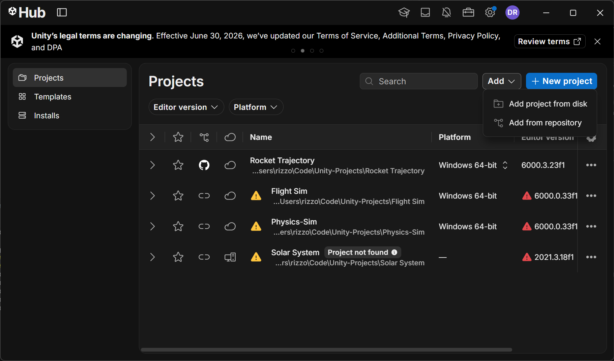
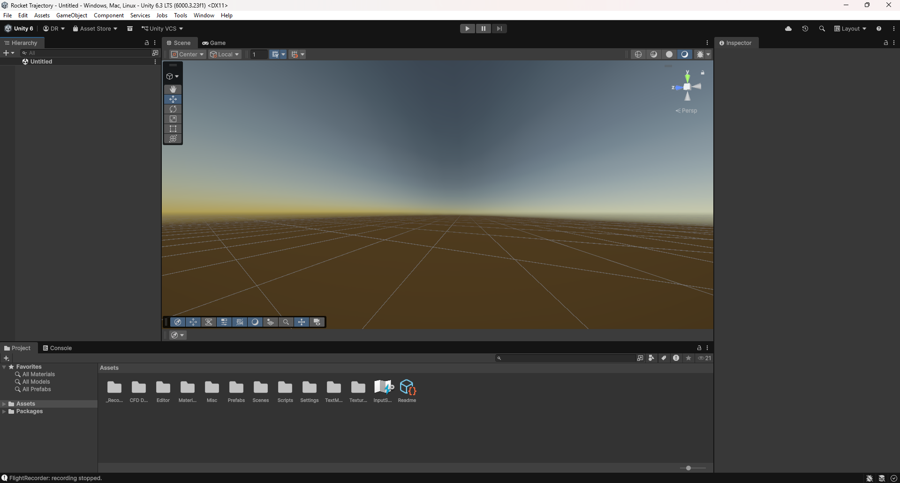
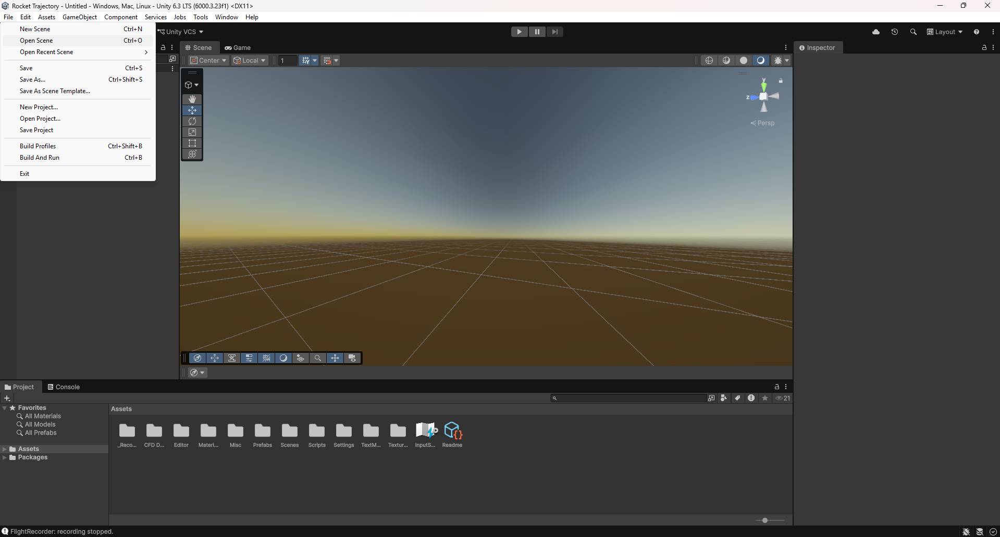
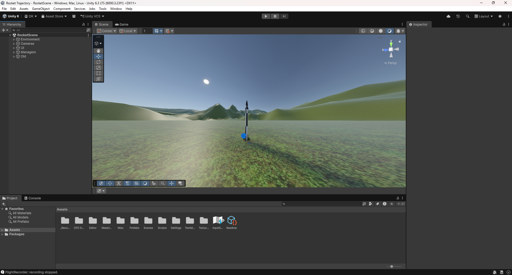
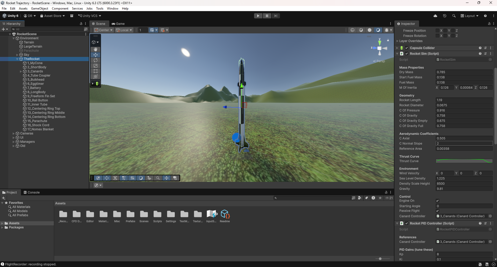
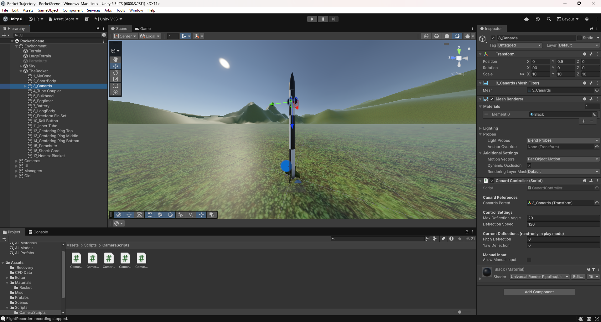
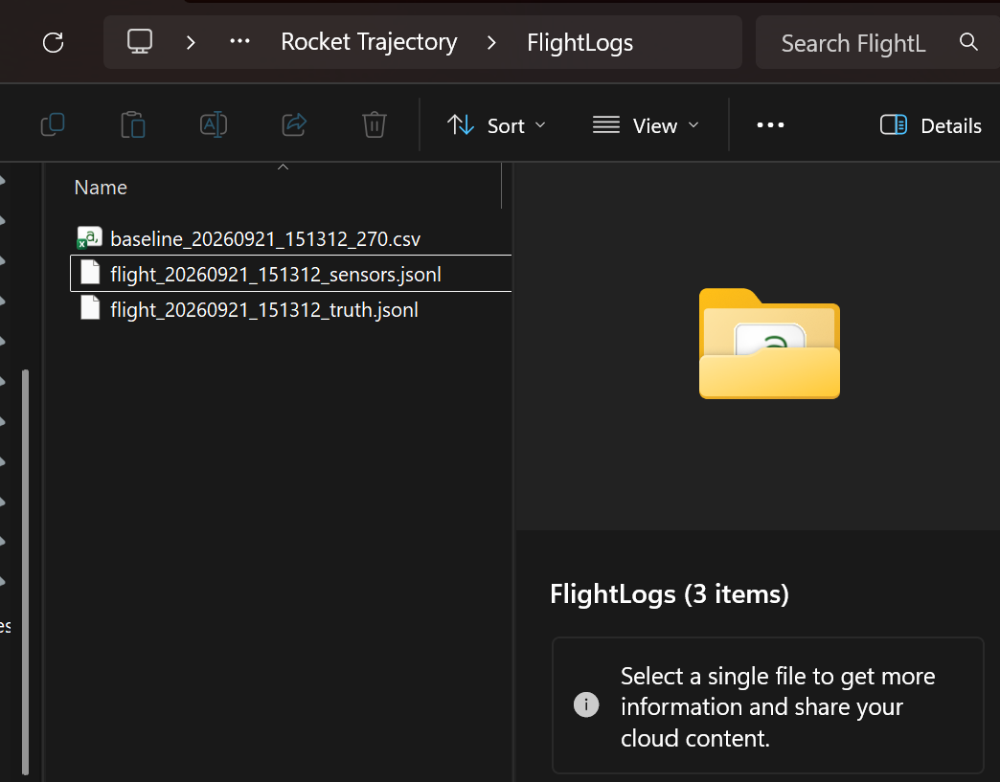
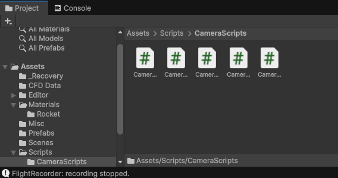
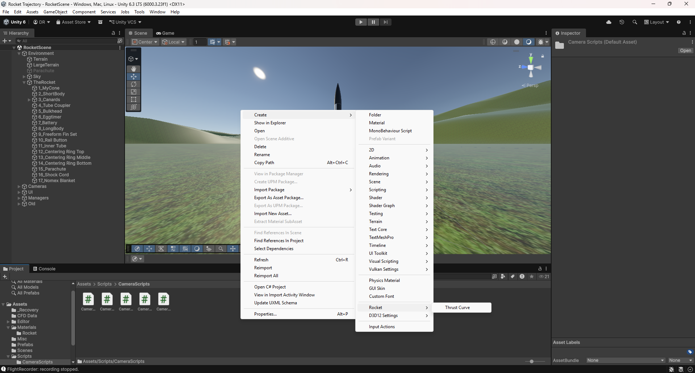

# Usage and features

## Opening the project
1. Visit https://unity.com/products/unity-personal, download and install the latest version.
2. Clone this repo:
   ```sh
   git clone https://github.com/endeavourrockets/A-StaR-Unity-Rocket-Simulation.git
   ```
3. Open Unity Hub and add the cloned project directory (**Add** -> **Add project from disk**). Alternatively, skip step 2 and add the project directly from this repository (**Add** -> **Add project from repository**).


4. Open with the matching Unity version. Wait for packages, libraries, and shaders to sort themselves out. Normally, this can take up to 5 minutes on the first run.
5. Once loaded in, **File** -> **Open Scene** -> `Assets/Scenes/RocketScene.unity`. This is imporant as otherwise you won't have anything in your editor. Check the Console for compilation errors before entering Play mode.




## Modifying parameters
- Selecting **TheRocket** allows you to change different configuration parameters directly through Unity's UI editor in the **Inspector**. You can inspect the **RocketSim** component for mass, geometry, thrust, wind, gravity settings, etc... Whatever values you assign through the inspector will override the hardcoded values int the C# scripts. This is standard in Unity for debugging, and any values you alter in the Inspector will be saved for other people too.

- For active stabilisation keep **Rocket PID Controller** enabled and CanardController's (**3_Canards** object under **TheRocket**) **Allow Manual Input** disabled. For manual control, do the reverse.

- FlightRecorder writes paired `flight_<date>_<time>_truth.jsonl` and `flight_<date>_<time>_sensors.jsonl` files into `FlightLogs/`. The Console reports their paths. Generated logs are ignored by Git.

- There are extra camera behaviours in `Assets/Scripts/CameraScripts/`.

- To turn a CSV thrust curve into a Unity Asset: **Right Click** -> **Create** -> **Rocket** -> **Thrust Curve**, then open it in the inspector, drag the selected thrust into it and click **Import CSV**.


## Importing a Rocket from OR
1. Open OR model and select all components.
2. **File** -> **Export as...** -> **WaveFront OBJ (.obj)**.
3. Drag into the Unity `Assets\` folder.
4. Set **Scale Factor** to 0.001 and save.
5. Drag the prefab rocket into the scene.
6. **Right-click on the rocket** -> **Prefab** -> **Unpack Prefab**
7. Click on the rocket and attach any useful components, adjusting any parameters as required.